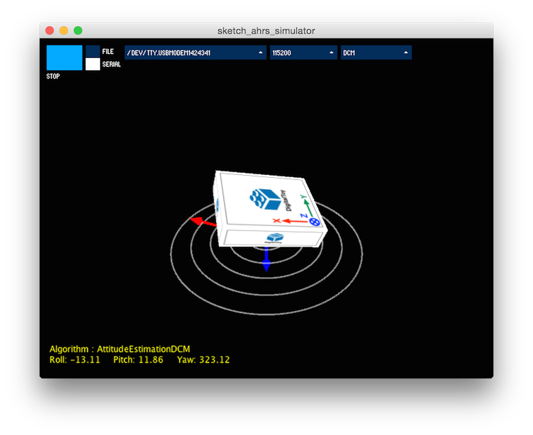
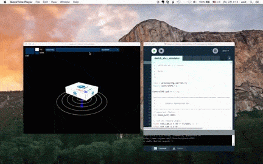

AHRS Simulator
====================

AHRS(Attitude Heading Reference System) 알고리즘의 동작을 테스트할 수 있는 간단한 시뮬레이터입니다. 시리얼 포트를 통해 입력한 IMU 데이터 혹은 IMU의 로그파일로, 사용자가 작성한  AHRS 알고리즘을 실행하고, 그 출력(eular angle)을 화면상에 3D box로 보여줍니다.  



알고리즘을 개발할 때엔 matlab이나 python 같은 스크립트 언어를 사용하면 매우 편합니다. 하지만 구현한 알고리즘을 AVR이나 STM32 같은 MCU에서 동작시키려면 C/C++ 코드로 바꿔야 하는데, 그리 수월한 일은 아닙니다. 게다가 AHRS의 출력은 3차원 공간상의 자세인지라 펌웨어로 구현한 알고리즘의 성능을 확인하며 디버깅하는 일 또한 만만치 않습니다. 

AHRS Simulator는 java(프로세싱)로 구현하였습니다. 알고리즘을 프로토타이핑 하기엔, java가 matlab이나 python만 못할지 모르지만, 그래도 C/C++ 보단 덜 성가십니다. 게다가 java코드는 C++과 유사해서 C++로 이식 측면에서 보자면 matlab이나 python보단 낫습니다. 

요컨대 사용자는 다음의 흐름으로 AHRS Simulator를 사용할 수 있습니다. 
* 알고리즘을 java로 구현한. 
* 실제 IMU 센서를 붙여서 테스트 한다.
* 만든 알고리즘을 C++로 이식하기 쉬운 형태로 가다듬는다. 
* 알고리즘을 펌웨어로 이식한다. 

## 실행환경 

본 프로그램을 사용하기 위해선 프로세싱과 프로세싱 라이브러리인 controlP5를 설치해야 합니다. 

* [Processing](https://processing.org)
* [controlP5](http://www.sojamo.de/libraries/controlP5/)

## 사용방법 

본 영상은 실행 방법입니다. 
* 시리얼 포트와 알고리즘을 선택한 후 실행하면 됩니다. 

[](http://youtu.be/8zQYiPuJAzc)

## 프로그램 수정 

### 자세추정 알고리즘 추가

잘 알려진 알고리즘을 AttitudeEstimationDCM 클래스로 구현하였습니다. 소스의 출처와 관련 문서는 아래의 링크를 참고하세요. 공부의 시작점으로 적절하다고 봅니다.  
* http://gentlenav.googlecode.com/files/DCMDraft2.pdf
* https://github.com/ptrbrtz/razor-9dof-ahrs/tree/master/Arduino/Razor_AHRS

다음은 알고리즘을 추가하는 절차입니다. 

* algorithm.pde 에서 AttitudeEstimation를 상속한 어떤 클래스 Foo를 정의합니다. 
* Foo.update() 메서드를 구현합니다. 이 메서드는 받은 ImuData 오브젝트로 자세를 추정하는 메서드입니다. 
* Foo.get_eular_angle() 메서드를 구현합니다. 이 메서드는 추정한 자세를 오일러각으로 바꿔서 출력하는 메서드입니다. 
* 끝으로 Foo 클래스를 attitude_estimation_algorithm_list에 추가하고 create_attitude_estimation_object() 함수도 수정합니다. 
  * 이렇게 등록하면 프로그램 실행시 사용자 알고리즘이 UI의 알고리즘 리스트에 추가되고 선택할 수 있습니다.  

AttitudeEstimationUser 클래스는 알고리즘 추가 예제 입니다. AttitudeEstimationUser 클래스의 이름을 바꾸어 사용해도 무방합니다. 

```java
class AttitudeEstimationUser extends AttitudeEstimation
{
	float count;
	
	public AttitudeEstimationUser(float hz) {
		super(hz);
		count = 0;
	}
	
	public void update(ImuData imu_data) {
		count += 0.01;
		//println("AttitudeEstimationUser.update() "+ imu_data.to_string());
	}
	
	public EularAngle get_eular_angle() {
		float roll = PI*sin(count * 0.1);
		float pitch = PI/2*sin(count * 0.2);
		float yaw = PI*sin(count * 0.3) + PI;	
		
		float rad2deg = 180/PI;
		
		return new EularAngle(roll*rad2deg, pitch*rad2deg, yaw*rad2deg);
	}
}

```

### IMU 센서 메시지 해석기 추가 

사용자가 보유한 IMU센서는 UART로 ASCII문자열 형식의 메시지를 출력한다고 가정하였습니다. 저는 가진게 myAHRS+ 밖에 없어서 myAHRS+의 메시지만 구현하였습니다. 

다음은 IMU센서 메시지 해석기를 추가하는 절차입니다. 

* imu_protocol.pde의 ImuProtocol 클래스를 상속한 어떤 클래스 Foo를 정의합니다. 
* Foo.get_sampling_rate_hz()를 구현합니다. 이 메서드는 센서 혹은 로그파일의 샘플링 레이트를 리턴합니다. 
* Foo.init_imu()를 구현합니다. 이 메서드는 시리얼포트를 열때 호출되어 IMU 센서 모듈을 초기화하는 역할을 수행합니다. 
* Foo.parse()를 구현합니다. 이 메서드는 매개변수로 넘겨받은 문자열로부터 가속도, 각속도, 지자기 값을 읽 ImuData 객체를 반환합니다. 
* 끝으로 create_imu_protocol() 함수를 사용자가 정의한 Foo 객체를 리턴하도록 수정합니다. 
